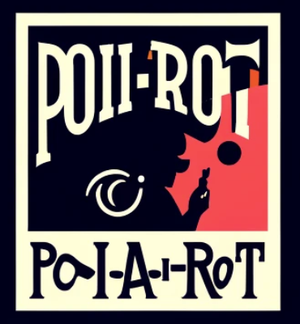

# Po(AI)rot

# Preconditions
Create file env.properties and put it in src/main/resources
 
## Weaviate database
Go to weaviate.cloud (free option is available) and create a weaviate cluster and set the following properties in env.properties:
- weaviate_url
- weaviate_api_key

# Open API
Use OpenAPI credentials and set the following in env.properties:
- openai_api_key
- organization_id

# Run the program
Main class: com.sundbybergsit.poairot.PoairotApplicationKt
Program argument is sent as a String
